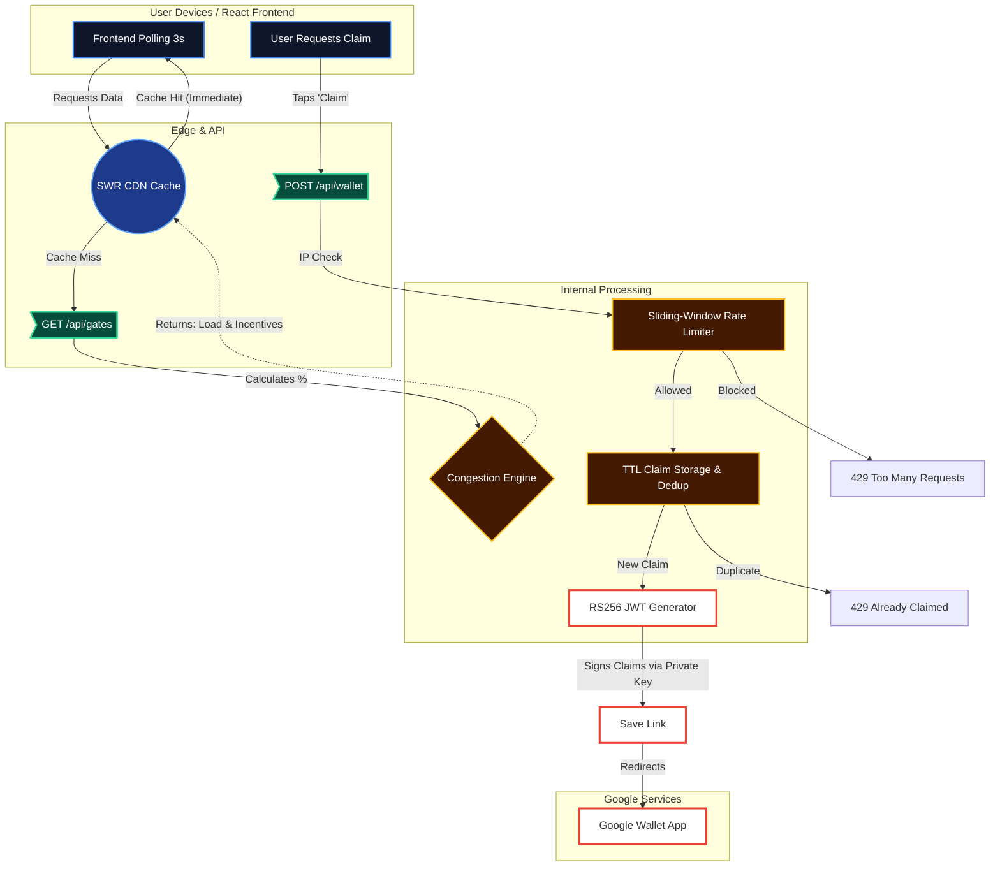

# System Architecture: Exodus load balancer

Exodus orchestrates a secure data pipeline to transform stadium telemetry into cryptographically verifiable user incentives. By coupling serverless API caching with in-memory abuse prevention, the system comfortably scales to stadium-sized bursts of traffic.

## Component Interplay
1. **Frontend Polling & SWR Cache:** The React frontend polls `GET /api/gates` every 3 seconds. To prevent the server from melting under simultaneous requests from 80,000 users, the response is aggressively cached via `stale-while-revalidate` CDN directives.
2. **Congestion Engine:** Pure utility functions calculate current crowd density against physical gate capacity. If capacity exceeds configured thresholds (>70% or >85%), it automatically dictates delay timings and reward tiers.
3. **In-Memory Rate Limiter:** `POST /api/wallet` intercepts traffic through an IP-based sliding window and a short-lived TTL claims cache, neutralizing rapid-fire abuse or malicious bot networks.
4. **Wallet Pass Generator:** Validated requests trigger the issuance of a customized Generic Pass mapped to our `ISSUER_ID` and `CLASS_ID`. An RS256 token is signed using server-side service credentials and returned as an actionable link, transferring the incentive directly into the user's Google Wallet.
